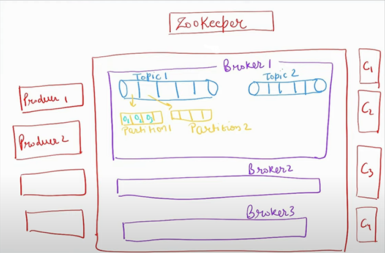

# Kafka
> Publish-subscribe based durable messaging system, exchanging data between processes, applications and servers
* Asyncronous communication between services
* We don't need to wait for the responce while communicating between services.

- **Producers** are applications that publish to Kafka topics
- **Consumers** subscribe to one or more topics and consume messages from partitions
- **Brokers** are individual servers within the Kafka cluser. They store and manage data, handle producer and consumer requests, and participate in the replication and distribution 
- **Topics** are logical channels and or categies to which messages are published. Topics can be divided into partitions for scalability & parallelism
- **Partitions** allow Kafka to distribute and parallelize the processing of messages of data.
- **Offset** represents the position of a consumer within a partition. 
- **Offset Manager** manages the order of the messages and ensures that consumers can properly resume processing from the last committed offset in case of failures or restarts
- **Consumer Group** contain consumers. Each group processes a subset partitions, allowing for parallel processing and load distribution.
- **Zookeeper** coordiantes and manages Kafka clusters, where the data is stored

* Hierarchy of the Kafka: `Cluster -> Brokers -> Topics -> Partitions -> Offsets`
* 
* Brokers are replicated where one is the Leader and others are replicated followers for fault tolerance
* Order is managed by kafka with the offset management

## pom.xml
```
  <dependency>
      <groupId>org.springframework.kafka</groupId>
      <artifactId>spring-kafka</artifactId>
  </dependency>
```
## Producer (sends)
1. create event (dto to send to other service)
2. Autowire KafkaTemplate<topic_name_type, message_type>
3. kafkaTemplate.send("topic", object);
## Consumer (retreives)
1. Create listener with argument as evenObject to retreive:
```
@KafkaListener(topics = "yourTopic", groupId = "yourGroupId")
public void handleNotification(NotificationEvent notificationEvent){
    
}
```
## application.yml
```
spring:
  kafka:
  bootstrap-servers: ${KAFKA_URI:localhost:9092}
  producer:
    key-serializer: org.apache.kafka.common.serialization.StringSerializer
    value-serializer: org.springframework.kafka.support.serializer.JsonSerializer

  consumer:
    key-deserializer: org.apache.kafka.common.serialization.StringDeserializer
    value-deserializer: org.springframework.kafka.support.serializer.ErrorHandlingDeserializer
    properties:
      spring:
        deserializer.value.delegate.class: org.springframework.kafka.support.serializer.JsonDeserializer
    group-id: order-service
  properties:
    spring.json.type.mapping: tag:path_reference
```
```
# confluent kafka
  kafka:
    bootstrap-servers: ${KAFKA_BOOTSTRAP_URI:your_kafka_bootstrap_servers}
    properties:
      sasl:
        mechanism: PLAIN
      security.protocol: SASL_SSL
      sasl.jaas.config: org.apache.kafka.common.security.plain.PlainLoginModule required username='${KAFKA_CLUSTER_API_KEY}' password='${KAFKA_CLUSTER_API_SECRET}';
      session:
        timeout.ms: 45000
      spring.json.type.mapping:

    producer:
      key-serializer: org.apache.kafka.common.serialization.StringSerializer
      value-serializer: org.springframework.kafka.support.serializer.JsonSerializer

    consumer:
      key-deserializer: org.apache.kafka.common.serialization.StringDeserializer
      value-deserializer: org.springframework.kafka.support.serializer.ErrorHandlingDeserializer
      properties:
        spring:
          deserializer.value.delegate.class: org.springframework.kafka.support.serializer.JsonDeserializer
      group-id: your-group-id
```
## docker-compose.yml
```
services:
  zookeeper:
    image: confluentinc/cp-zookeeper:7.0.1
    container_name: zookeeper
    ports:
      - "2181:2181"
    environment:
      ZOOKEEPER_CLIENT_PORT: 2181
      ZOOKEEPER_TICK_TIME: 2000
      
  broker:
    image: confluentinc/cp-kafka:7.0.1
    container_name: broker
    ports:
      - "9092:9092"
    depends_on:
      - zookeeper
    environment:
      KAFKA_BROKER_ID: 1
      KAFKA_ZOOKEEPER_CONNECT: 'zookeeper:2181'
      KAFKA_LISTENER_SECURITY_PROTOCOL_MAP: PLAINTEXT:PLAINTEXT,PLAINTEXT_INTERNAL:PLAINTEXT
      KAFKA_ADVERTISED_LISTENERS: PLAINTEXT://localhost:9092,PLAINTEXT_INTERNAL://broker:29092
      KAFKA_OFFSETS_TOPIC_REPLICATION_FACTOR: 1
      KAFKA_TRANSACTION_STATE_LOG_MIN_ISR: 1
      KAFKA_TRANSACTION_STATE_LOG_REPLICATION_FACTOR: 1
```