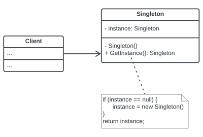
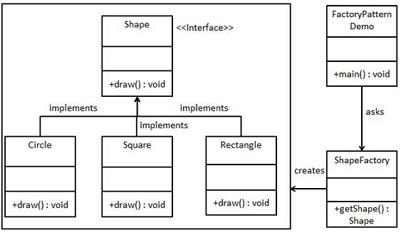
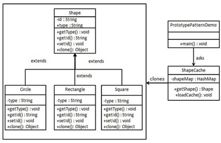
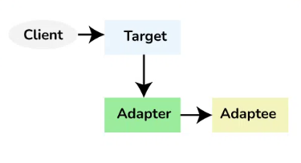
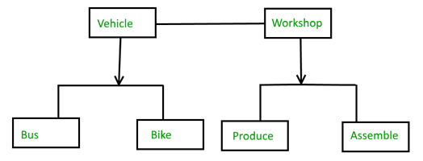
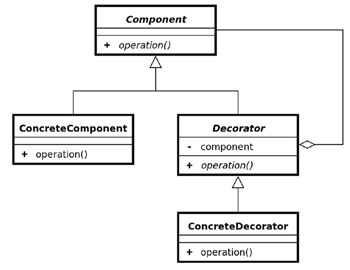

# Design Patterns
- **S** - Single Responsibility (one class or method must have only one responsibility)
- **O** - Open Closed (Classes/functions are open for extension but closed for modification)
- **L** - Liskov Substitution (Objects of a superclass should be replaceable with objects of its subclasses without affecting the correctness of the program)
- **I** - Interface Segregation (Create interface only with methods that are required)
- **D** - Dependency Inversion (Parent module should not be dependent on the low-level module)
### Singleton
Create the object only once and use it across all the application
Use private Constructor that we can't create object from the class, and static method to retriev the same object
- 
### Factory Design Pattern
Pattern that provides an interface for creating objects but allows subclasses to decide which class to instantiate
- 
### Buider Design Pattern
The key idea behind the Builder Pattern is to provide a flexible and readable way to construct objects with a large number of optional parameters or configurations (@Builder in Lombok)
### Prototype Design Pattern
Create new object by extending the base object (Base class implements Clonable)
- 
### Adapter Design Pattern
Adapter Design Pattern allows incompatible interfaces to work together. It acts as a bridge between two incompatible interfaces by converting the interface of one class into another interface that a client expects.
- 
### Bridge Design Pattern 
Bridge Pattern allows to create a bridge between the abstraction and its implementation, allowing them to vary independently of each other. 
- 
### Decorator Design Pattern
Decorator Design Pattern allows behavior to be added to individual objects, either statically or dynamically, without affecting the behavior of other objects from the same class
- 
# Monolith vs Microservices
### Monolith
+ Easy to scale by having multiple copies (scale horizontaly)
+ Better for small scale apps
- Limitation in size
- Complexity grows with time
- Even small change in one module needs redeployment of whole application
- Hiring new team and making them understand whole application is tough
- Stuck in one programming language
- Single point of failure
### Microservices
+ Self Organization
+ Isolated decision making
+ Easy and quick to scale - on demand
+ Experiment with any technology
+ Loose coupling
+ Service Reusability
+ Best for large scale apps
- Additional complexity with distributed systems
- Monitoring complexity
- Complex communication between services
## Microservices Design Principles
- **Independent / Autonomous**
    - Parallel developement
    - Individual deployment
- **Resilient / Fault Tolerant / Design For Failure**
    - Avoid single point of failure
    - Avoid cascading failure
    - Consider failure as event and analyse it properly
- **Observable**
    - Centralized monitoring
    - Centralized logging
    - Health check system
- **Discoverable**
    - All services registered in one place
- **Domain Driven**
    - Focussed on business
    - Focused on core domain
    - Focus on Domain logic
- **Decentralization**
    - Choice of database depends on the nature of particular service
- **High Cohesion**
    - Single Responsibility Principle
- **Single Source of Truth**
    - One source/service to get the particular information
    - It helps to avoid the duplication
## Why do we need Microservices Design Patterns
- We need our services to be highly
    - Available
    - Scalable
    - Resilient to failures
    - Efficient
- Design patterns help solving specific microservice aechitecture challenge
- Design patterns help reducing risk of failure in microservices