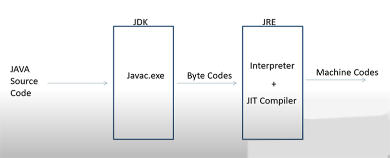

# Java 8 Features
- **Default methods in an interface**
- **Static methods in an interface**
- **Function Interface**
    * Interfaces that have exactly one abstract method, often representing a single function contract
    * Used as refernce to the lambda expressions
    * Types on functional interface
        - Built-in
        - User defined
- **Stream**
    * Stream - is a sequence of Bytes (8 bit binary data)
    * Functions in streams (filter, map, distinct, sort, toList)
- **Lambda function(expression)** - anonimous function that can execute some logic, you can pass it as a parameter
- **Method refference**
- **Optional**
## Features of Java
* Platform independent (we compile anywhere to bytecode and run anywhere on JVM)
* Strongly typed
* Multithreading ( > 1 task at a time)
* OO (Class/Object, encapsulation, polymorphysm, Inheritance, Abstraction)
* Compiled then interpreted
* Memory management (Garbage Collector)
* Robust exception handling
* Pointers are not used in Java because:
    - It's unsafe
    - Increases complexity of the program since Java known for its simplicity
    - JVM is responsible for implicit and user doesn't have direct access to memory
### Terms
- **IDE** - a software application that helps develop software code efficiently
- **JDK** - Java Development Kit - contains everything you need to compile and run your java programs
- **JRE** - Java Runtime Environment - run Java. JRE consists of runtime libraries + JVM
- **JVM** specification that provides runtime environment where bytecoe is executed. Consits of:
    - Class area - variables, methods, classes
    - Heap - created objects
    - Stack - stores local variables and partial results (recursion uses the stack)
    - PC Registers - contain instructions executed in JVM
    - Native method stack - contains native methods
- **JRE execution model:**
```
1) Javac.exe - Java compiler that converts Java code into bytecode which goes to JVM
2) Bytecode is os independent and using JiT and Interpreter is converted into machine code
3) JiT - Just in Time compiler - responsible for performance optimization of Java application at the runtime (used for converting bytecode into machine code)
```

- **Exception propagation** - process by which exceptions are passed from a method that throws them to the method that called it, continuing up the call stack until they are handled or the program terminates.
- **finalize()** - method called before garbage collection
- **System.gc()** - static mehtod of system class to forcefully run the garbage collector that cleans Heap memory
# OOP Features
### Classes and Objects
> Java is not 100% OO language because of the primitive data types *(e.g. int, boolean, char...)*, but we can use wrapper classes to "wrap" the primitive classes into the object of that class
- Class is a blueprint to create an object
    - Object - is an intance of a class 
    - Constructor - method that initializes the state and value during object creation.
> Why do we need private constructor?
- **Prevent instantiation:** prevent other classes to create new instance of a class
- **Singleton pattern:** class enshures that only one instance is created
- **Factory methods:** control how objects are created, validation
### Types of Classes
- Class A {} - concrete class (can be inherited, Object)
- abstract Class B {} - incomplete class (can be inherited, no Object)
- final Class C {} - for example String class, used for creating immutable objects (no inheritance, can be created Object)
* final method - not overrinding
* final variable - no modifications
Purpose of immutable objects:
- To not allow users to edit data
- Used in multithreading when you can view but cannot edit data (Read-only feature for user)
* static import: set of statements that is running when class is loaded. In this block we can write static members initialization code.
> Object Class: supercalss for all hierarchy. Default superclass.   
> Wrapper Class: represents a primitive data type as an object (int <=> Integer)
- Collections
* Outboxing: make an object from primitive value
* Unboxing: make a primitive from an object
### Encapsulation
> **A way to hide data or methods from outsiders**
- Binding data and function together through the access modifiers: public, private, dafault, protected
    - public: accessible everywhere
    - protected: accessible inside the package + children outside the package
    - default: accessible inside tha package
    - private: accessible inside the class. Cannot be inherited or children
### Polymorphysm
> **Many forms** of a method
- Overloading: parameters change leaving the same name of the method
- Overriding: change the body of function while inheriting
* **You cannot override a constructor**
* **You cannot overrinde private and static methods**
### Inheritance
A feature that allows you:
- to reuse the code
- reduce effort of writing the code
- reduce maintenance
Types of inheritance:
1) Single: Person <= Manager
2) Multilevel: Person <= Employee <= Manager
3) Hierarchical: Tree Structure
4) Multiple Inheritance (interface)
- Child constructor executes parent constructor **(super() before everyhting)**
### Abstraction
> Abstraction is a way to hide an implementation
- Abstract class (you can't create objects from abstract classes. It can have implemented or abstract methods, doesn't support multiple inheritance)
- Interface (We use it through child classes. Abstract methods have no bodies. Supports multiple inheritance)
- Marker interface is an interface that does not contain any method declarations. Marker interfaces are often used to signal to the compiler or runtime environment that a class possesses certain characteristics or should be treated in a specific way. Examples of marker interfaces in Java include Serializable and Cloneable.
- A skeleton, a blueprint without implementation
- Can be used to describe featured of a system entity
- May be used to represent abstraction
- May have methods with bodies if it is a default static method
- All vars are public, static, final (no private, no protected)
- No constructor
## Assosiation
- **Assosiation** - relationship between 2 not related entities(classes). For assosiation use interface:
    Class A wants to use data from class B:
    1) Inheritance
    2) Relationship
    Assotiation has two types:
    - Agregation - when 2 entities can survive individualy, ending one entity will not affect the other entity(Teacher=>College<=Student)
    - Composition - entities highly dependent on each other(Car=>Engine=>Oil)
## Annotation
- Annotation - tells to compiler some instructions during the runtime.
- Runtime building is dynamic
- @Override while runtime decides what function to choose
## Exceptions
> How to handle
1) try/catch
2) try/catch/finally or try/finally
3) throw/throws
> Exceptions break flow of the program if not handled. The indicator that something went wrong during runtime.
1) Error: beyond the control of the program (sytax error)
2) Logical error: unexpected output
3) Exception: fixable by exception handling
- Throwable is the support class for all types of exception
Types of exceptions:
- Checked: thrown during the compilation (is not a programmer fault - file not found)
- Unchecked: Runtime exception
## String
> String is **immutable** because of the security purpose and beacuse String pool requires strings to be immutable, otherwise shared reference can be changed from anywhere
- Stored in a *constant pool* since it is immutable it is constant
- For constantly changing strings use:
    - StringBuffer: threadsafe, low perform
    - StringBuilder not threadsafe, high perform
## HashCode
> HashCode is an address
- We use it for hashing purposes in HashSet, HashTable, HashMap. 
- Works closely with equals method.
- To override HashCode we used to override equals(), hashcode().
## Threads
> Thread is the direction or path that is taken while a program is being executed (an activity to do something)
> Process: any program that has its own memory space. Thread is a part of a process, does share memo.
> Multithreading: can be **Multithreading based** or **Multiprocess based**
- Multithreading: many threads run in a process
- Multiprocess: many apps/prcesses run in one thread
JVM scheduler(threadscheduler): native-platform dependent!
### How to create threads:
1) By inherit Thread class
2) By implementing Runnable
3) Thread pool - modern way
Concurracy: more than one thread is making progress, but the threads are not actually running simultaneously
Multithreading: all threads run on one process
### Thread lifecycle
1) New:
    - when we instantiate a thread
2) Runnable: 
    - thread moves to Runnable pool ( start(); => scheduled for execution, ready to go )
3) Running State: 
    - when actual processor allocated to thread for execution
4) sleep():
    - Timed-Waiting
5) Wating State: 
    - Join() - thread joined another thread.
    - Wait() - waiting for the lock of an object which runs by another thread
6) Blocked State: 
    - When interrupt came and thread is blocked
    - We are waiting to execute an another thread
7) Dead state:
    - Once it completes run()
### Threads Pools
* Prefered Pool of available working threads can be assigned to a task when comes from event. Working thread are reusable.
* Types of Thread Pools:
1) Fixed Thread Pool
2) Cached-Dynamic
3) Single Thread
4) Scheduled Thread Pool
- Synchronization is a mechanism that allows many threads to run concurrently to access the data one at a time by locking
- Concurrency indicates that more than one thread is making progress, but the threads are not actually running simultaneously.
**2 ways in Java**
1) Implicit lock - by making method to be synchronized
    - KeyWord *synchronize* locks an object to use by thread
    - wait(): tells the thread to wait for a lock to be released
    - notify(): waiting thread gets signed that lock is free
    - wait() and notify(): interthread communication
2) Explicit - by creating a lock object from noncurrent API
    - Lock fairness: one who is waiting more gets a lock
* DeadLock - 2 or more threads competing for a lock to release. one waits another, but that one waits for the first one
* Daemon Thread - is low-priority threads that run in the background to perform tasks such as garbage collection or provide services to user threads.
## Collections
> Collection is a way of grouping of objects in a single unit
Core interfaces:
- ArrayList is for storing data, LinkedList is for manipulating the data
- HashTable is synchronized and thread safe and HashMap is not, beacuse of that HashMap appears to be mush faster. HashTable cannot contain `null` keys
- WeakHashMap is a class in Java that provides a hash table implementation with weak keys, meaning that keys that are no longer referenced elsewhere in the program may be automatically removed from the map is the Map is elegible for the garbage collector.
### Iterator
> Iterator - is an interface that allow the collection to be iterated from beginning till the end
- Iterator has functoins:
    - hasNext() - true/false
    - next() - returns the next element from the next index
- Iterable is an interface returns an Iterator that we can do modifications through Iterator to Collections
- ListIterator has a function previous() we can traverse from the end to the beginning but only for List
1) KeySet - `for (String key : map.keySet())`
2) ValueSet - `for (Integer value : map.values())`
3) EntrySet - `for (Map.Entry<String, Integer> entry : map.entrySet())`
### Compare Objects
- Class must implement Comparable Interface.
- If you want to create custom comparator for your object, than object must `implements Comparable<YourObject>` and @Override method `public int compareTo(YourObject o){}`
- Class that `implements Comparator<YourObject>` has to @Override the function `int compare(YourObject a, YourObject b){}` or you can use lambda in sorting function