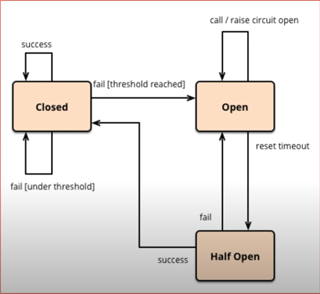

# Microservices Design Patterns
- **BFF (Backend For Frontend)**
    - Separate backend service specifically tailored to the needs of a particular frontend or client application
    - In the BFF pattern, each frontend or client application has its own dedicated backend service or services.
    - Encapsulates the logic required to fetch data from various backend services, aggregate it if necessary, and shape it into the appropriate format for consumption by the frontend.
    - The BFF pattern can also provide an additional layer of security by exposing only the necessary backend functionality to the frontend.
## Decomposition Patterns
- **By Bussiness Domain (How to divide a monolith?)**
    - Decompose Monolith app into Microservices by business functionality
- **By Subdomain (How to decide the size of microservices)**
    - God Classes *(shared among different services)*
    - Sub Domain *(bounded context, divided by Domain Driven Design)*
- **Strangler Pattern**
    1. Identify the module that you want to convert to microservice
    2. Using route put old and new service to exist at the same time
    3. By the time eliminate the old flow
- **Sidecar/Sidekick Pattern**
    - Deploying a helper application, known as a sidecar, alongside the main application to provide supplementary features or services
    - Usually the sidecar application handles specific concerns, such as logging, monitoring, security, or communication with external services
- **Service Mesh**
    - A dedicated infrastructure layer for handling service-to-service communication.
    - Provides capabilities such as service discovery, load balancing, encryption, authentication, and observability.
## Database Patterns 
- **Database Per Service**
    - Free to choose any database type
- **Shared Database**
    - Simpler to operate
    - Runtime coupling
    - Services have to use the same database type
* **CQRS (Command Query Responsibility Segregation)**
    - Divide databases for create/update/delete and read <- Responsibility Segregation
    - Easy to scale
    - Data replication, events, methods
    - Replication delay
    - Extra complexity
* **2 Phase Commit**
    - Voting Phase (Phase 1): The transaction coordinator sends a prepare message to all participating nodes, asking them if they are ready to commit the transaction.
    - Decision Phase (Phase 2): If all participating nodes respond with a "yes" vote during the voting phase, the coordinator sends a commit message to all nodes. If any participating node responds with a "no" vote during the voting phase or the coordinator detects a failure, it sends an abort message to all nodes.
* **SAGA**
    - Breaking down a complex transaction into a series of smaller, self-contained steps called "saga steps.". 
    - Each step has to be a part of the main Transaction, which has to be ACID. Rollback if one of the operations fails
### Data Consitency
- **Eventual Consistency** guarantees low latency with some stale data
- **Strong consistency** guarantees updated/latest data with some higher latency
## Communitation Among Services
> Data exchange formats: XML(Extensible Mark-up Language) and JSON (JavaSctript Object Notation)
- **Synchronous**
- **Asynchronous - event/messaging based**
- **Graphql** (Better REST)
- **gRPC** (Remote Procedure Call)
## Integration Patterns
- **API Gateway** (Single Entry Point)
    - Aggregating data from multiple services
    - Client is using single standart protocol
    - Easy to change the location of the service (host, port)
    - Centralized security / logging / load balacing / caching / IP whitelistes / circuitbreaker
- **Aggregator Pattern**
    - Collaborating the data returned by each service
    - Calling all the services needed to make the response
    - Transform the response as per clients need
- **Chained Pattern**
    - From the other service we call another one in a chain
- **Branch Pattern**
    - From the service we can many services to compose the response
- **Client Side UI Composition Patterns**
    - Division frontend into microfrontend that communicates with the separate microservices
## Deployment Patterns
- Multiple Service Instances per Host
- Service Instance per Host
- Service Instance per VM
- Service Instance per Container
- Serverless
- Blue Green
- Canary
## Observability
- Log Aggregation
- Performance Metrics
- Distributed Tracing
- Health Check
## Cross Cutting Concern Pattern
- External Configuration
- Service Discovery Pattern
- Circuit Breaker Pattern
    - Defines how gracefully we handle the errors
    - 
